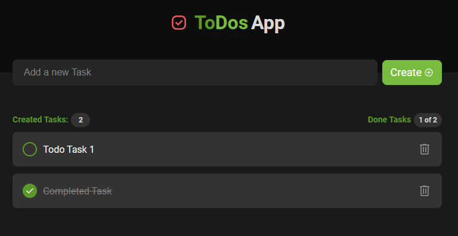

# Todo App

A simple todo app. By: [Coding Raccoon](https://github.com/Yakub357)

---

## Description

## 

This project implemented various data-binding techniques offered by angular.

- [(ngModel)]
- [ngClass]
- \*ngFor
- services
- local variables
- etc.

## Reference Design

The **Design** reference was taken from [IgniteDemo](https://ignite-to-do.vercel.app/)

## Styling

For css styling clean CSS is used with the defined classes for the project.
